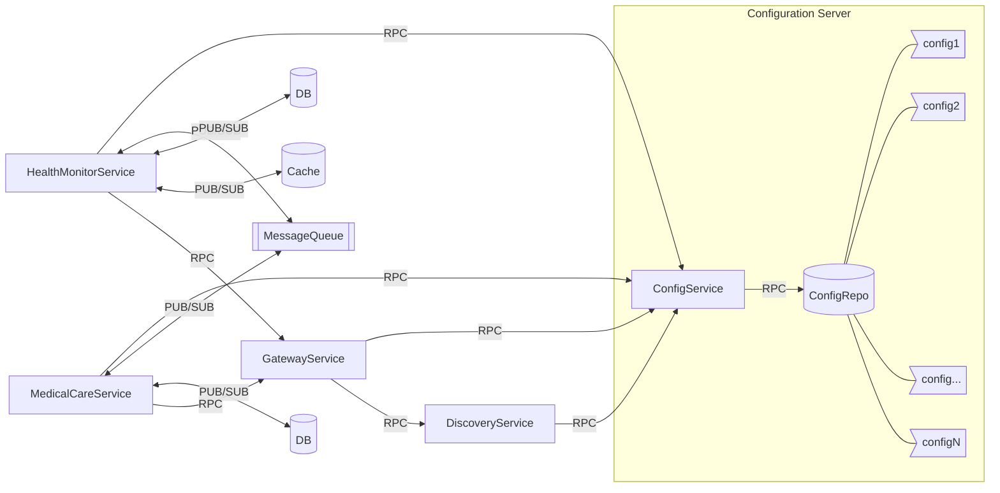
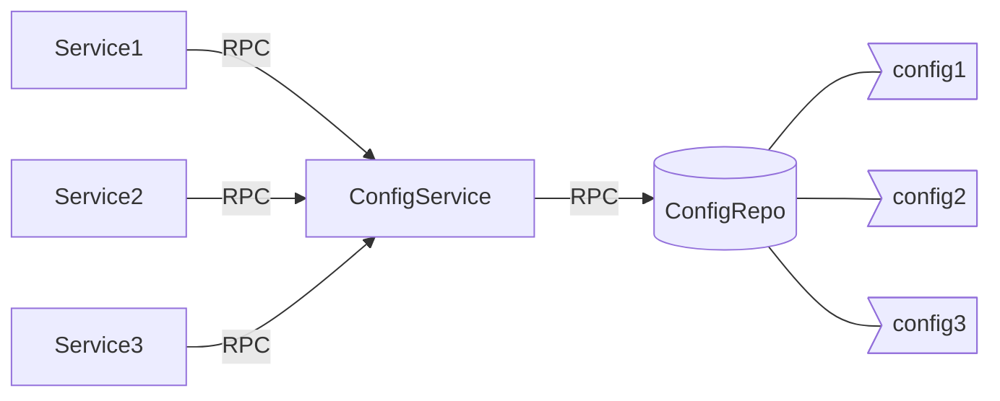
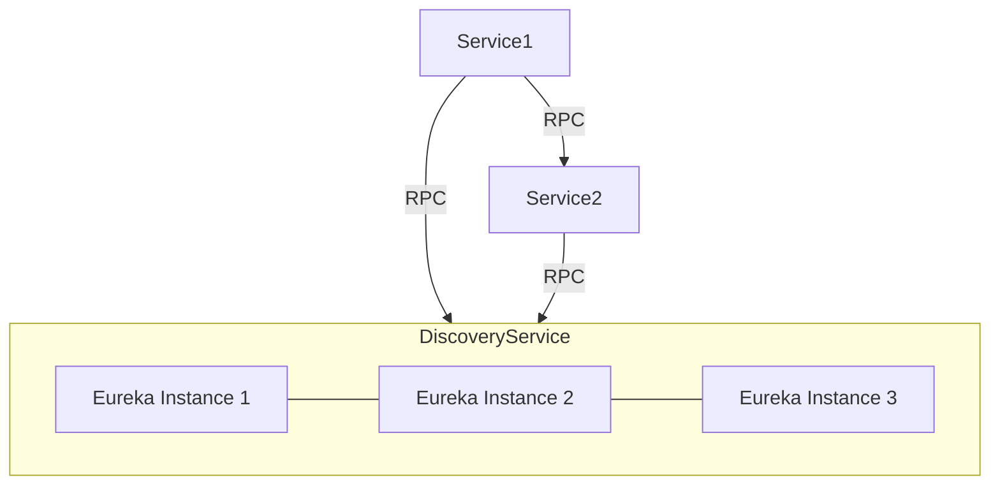
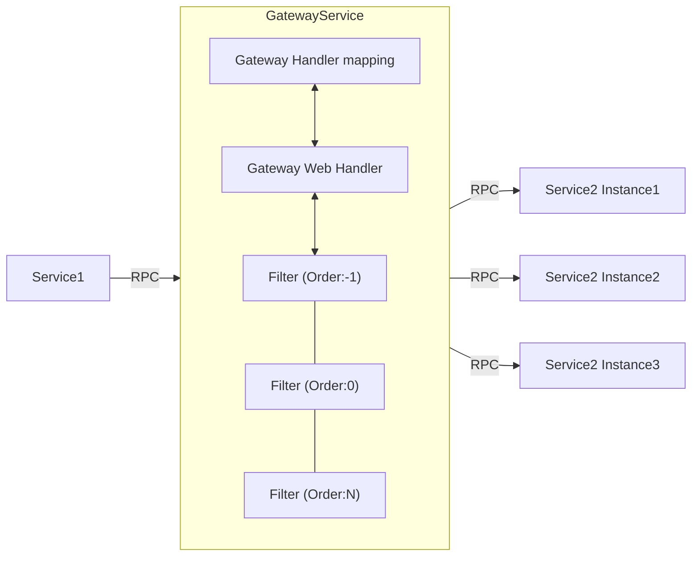
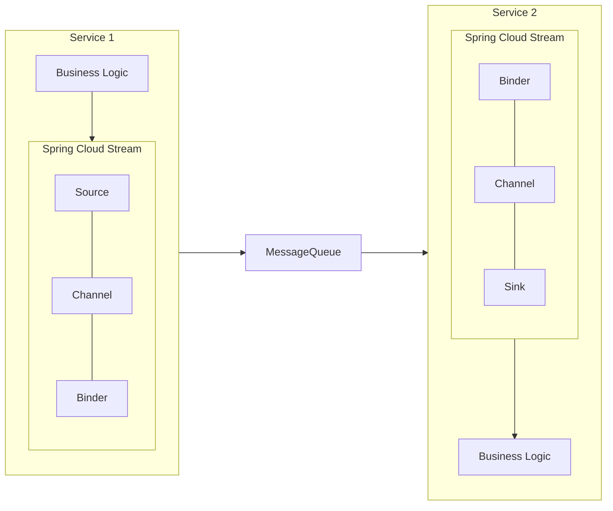

# Health Monitor Application

## An Example of Application Services for a Health Monitoring System Using Java/Spring

This is a demonstration project that implements application services in a microservice architecture using Java and the Spring framework. Inspired by the [Spring in Action](https://www.manning.com/books/spring-in-action-second-edition) book, the project's main focus is on showcasing how to build production-ready application services by leveraging Java and various Spring Family frameworks.

In the context of this project, the application consists of five microservices:

- **config-server**: Centralized configuration server that manages and provides configuration properties for all microservices.
- **discovery-service**: Service registry using Spring Cloud Netflix Eureka for locating microservices within the application.
- **gateway-service**: API Gateway using Spring Cloud Gateway to route requests to the appropriate microservice and handle cross-cutting concerns such as security and rate limiting.
- **health-monitor-service**: Core service responsible for health monitoring functionalities, collecting and processing health data, and issuing notification for urgent cases.
- **medical-care-service**: Service that provides medical care functionalities such as managing patient status and offering emergency medical instructions.

In addition, **Spring Cloud Config**, **Spring Boot**, **Spring Cloud Netflix**, **Spring Cloud Gateway** and **Spring Cloud Stream** are leveraged to build a resilient and scalable microservice architecture.

**Docker** and **Docker Compose** are used for deploying and managing the services, ensuring a consistent environment across different stages of development and production.

## Usage

### Launch Services

The services can be launched using Docker Compose.

**To launch the services:**

1. Navigate to the directory containing your `docker-compose.yml` file.
2. Run the following command:

    ```sh
    docker-compose up
    ```

### Stop Services

The services can be stopped using Docker Compose.

**To stop the services:**

1. Navigate to the directory containing your `docker-compose.yml` file.
2. Run the following command:

    ```sh
    docker-compose down
    ```

> **Note**: You may need `sudo` permissions to run these commands.

## Overview



## Service

### config-server

The config-server is a centralized configuration server that manages and provides configuration properties for all other services in the application. This service uses Spring Cloud Configuration Server to externalize configuration, making it easy to manage configuration changes without the need to rebuild and redeploy individual services.

**Key Features:**

- **Centralized Configuration Management**: The config-server allows all microservices to retrieve their configuration properties from a single, central location. This centralization simplifies configuration management, especially in environments with multiple microservices.

- **Spring Cloud Configuration Server**: The config-server leverages Spring Cloud Configuration Server, which can serve configuration properties from various sources. In this implementation, the configuration properties are stored in the local filesystem (native mode), providing a straightforward setup for managing configuration files.

- **Spring Profiles**: The config-server supports Spring profiles, enabling the management of different configurations for different environments (e.g., development, testing, production). Configuration properties can be tailored to each profile, ensuring that services run with the appropriate settings in each environment.

### discovery-service

The discovery-service acts as a service registry that manages the registration and discovery of microservices within the application. This service uses Spring Cloud Netflix Eureka to provide a robust service discovery mechanism, enabling services to find and communicate with each other dynamically.

**Key Features:**

- **Service Registration and Discovery**: The discovery-service allows microservices to register themselves at runtime as they come online. Eureka maintains a registry of active service instances, allowing client services to discover and connect to these instances without hard-coded URLs.

- **Health Monitoring**: Eureka periodically checks the health status of registered service instances. Unhealthy instances are automatically removed from the registry, ensuring that only healthy instances are available for client requests.

### gateway-service

The gateway-service acts as an API gateway, managing and routing client requests to various backend microservices. It processes these requests asynchronously in the background and returns a response once processing is complete. This service leverages Spring Cloud Gateway and integrates seamlessly with Netflix Eureka Discovery Service to provide dynamic routing capabilities.

**Key Features:**

- **Centralized API Gateway**: The gateway-service provides a single entry point for all client requests, routing them to the appropriate backend microservices. This centralization simplifies client interactions and abstracts the complexity of the underlying microservices architecture.

- **Dynamic Routing**: By integrating with Netflix Eureka, the gateway-service can dynamically route requests to the appropriate service instances based on their registration in the Eureka service registry. This ensures that client requests are efficiently directed to available and healthy service instances.

- **Asynchronous Processing**: The gateway-service processes requests asynchronously, improving the responsiveness and scalability of the system. Clients receive a response as soon as the request is accepted for processing, with the actual processing handled in the background.

- **Request Filtering**: Spring Cloud Gateway allows the creation of filters that can inspect and modify incoming and outgoing requests and responses. These filters can be used for various purposes, such as logging, authentication, rate limiting, and more.

- **Predicate Matching**: The gateway-service uses predicates to define conditions under which routes should be matched and processed. These predicates allow for flexible and dynamic routing based on request attributes such as headers, query parameters, and paths.

### health-monitor-service

The health-monitor-service acts as the data collection unit for collecting and aggregating the health information of patients. It then classifies the patient's status based on the aggregated results such as blood pressure and heartbeat. In addition, it sends the aggregated results as anomalies to the medical-care-service through the message queue and waits for the medical instructions accordingly. For further tracking, the anomalies and medical instructions are persisted.

**Key Features:**

- **Service Discovery Integration**: Registers the service with a service registry for dynamic scaling and efficient communication with other microservices.

- **Reactive Web Framework**: Provides a programming model to handle asynchronous request processing, improving the scalability and responsiveness of the service.

- **Asynchronous Messaging**: Enables the service to efficiently collect and process health data from various sources in real-time through a messaging system.
  
- **Reactive Data Operations**: Supports non-blocking data operations, allowing for real-time data persistence and retrieval with databases that handle reactive streams.

### medical-care-service

The medical-care-service acts as the processing unit to determine the medical instructions based on the received anomaly information. The anomaly information and the medical instructions are processed through a message queue, enabling efficient and real-time communication between services.

**Key Features:**

- **Service Discovery Integration**: Registers the service with a service registry to enable dynamic scaling and efficient communication with other microservices.
  
- **Reactive Web Framework**: Utilizes a programming model that handles asynchronous request processing, enhancing the scalability and responsiveness of the service.
  
- **Asynchronous Messaging**: Allows the service to receive anomaly information and send medical instructions in real-time, ensuring efficient data flow and timely responses.
  
- **Reactive Data Operations**: Implements non-blocking data operations for real-time data persistence and retrieval using databases that support reactive streams.

## Spring Framework

### Spring Cloud Config



> The Spring Cloud Configuration Server is a REST-based application that is built on top of Spring Boot. The Config Server doesn’t come as a standalone server. Instead, you can choose to either embed it in an existing Spring Boot application or start a new Spring Boot project with the server embedded in it. The best practice is to keep
things separated.

Spring Cloud Config supports various configuration sources, including Git repositories, SVN repositories, and local filesystems. This flexibility enables teams to choose the most suitable configuration management approach for their projects.

Moreover, Spring Cloud Config provides robust security features, including support for authentication and authorization mechanisms like OAuth 2.0 and JSON Web Tokens (JWT), ensuring only authorized users and services can access and modify configuration properties.

By leveraging Spring Cloud Config, teams can streamline the configuration management process, reduce operational overhead, and improve the resilience and scalability of their microservices architecture.

### Spring Cloud Netflix



Spring Cloud Netflix provides integration with Netflix OSS components, offering a comprehensive set of tools for building resilient and scalable microservices architectures.

Spring Cloud Netflix simplifies the development of distributed systems, providing a set of battle-tested tools for building resilient and scalable microservices architectures. By leveraging the capabilities of Netflix OSS components, Spring Cloud Netflix enables developers to focus on building business logic while abstracting away the complexities of distributed systems.

### Spring Cloud Gateway



> Spring Cloud Gateway is the API gateway implementation built on Spring framework 5, Project Reactor, and Spring Boot 2.0. (...). Spring Cloud Gateway offers several capabilities, including 
>    * Mapping the routes for all the services in your application to a single URL. (...)
>    * Building filters that can inspect and act on the requests and responses coming through the gateway. (...) these filters allow us to modify the incoming and outgoing HTTP requests and responses.
>    * Building predicates, which are objects that allow us to check if the requests fulfill a set of given conditions before executing or processing a request. (...)

Moreover, Spring Cloud Gateway integrates seamlessly with Eureka Service Discovery, enabling automatic route registration and dynamic routing based on service discovery information. This integration simplifies route configuration and maintenance, ensuring efficient request routing to available service instances without manual intervention.

Spring Cloud Gateway offers flexible mechanisms for defining routes with predicates and filters. Predicate factories specify conditions for route matching, such as specific headers or query parameters. Filter factories process and transform requests and responses, with common filters for logging, rate limiting, and authentication. These features allow for high customization and control over routing behavior.

Spring Cloud Gateway simplifies microservices communication by providing a centralized entry point for external clients. Its reactive architecture and Spring Boot integration offer high performance, scalability, and resilience, making it ideal for robust and efficient API gateways in modern microservices architectures.


### Spring Cloud Stream



> Spring Cloud makes it easy to integrate messaging into our Spring-based microservices. It does this through the Spring Cloud Stream project, which is an annotation-driven framework that allows us to easily build message publishers and consumers in our Spring applications.
> Spring Cloud Stream also allows us to abstract away the implementation details of the messaging platform that we’re using. We can use multiple message platforms with Spring Cloud Stream, ... The implementation of message publication and consumption in your application is done through platform-neutral Spring interfaces.

Spring Cloud Stream simplifies the development of message-driven microservices, providing a lightweight and flexible framework for building event-driven architectures. By abstracting away the complexities of messaging platforms and providing annotation-driven development, Spring Cloud Stream empowers developers to focus on building resilient and scalable microservices without being tied to specific messaging technologies.